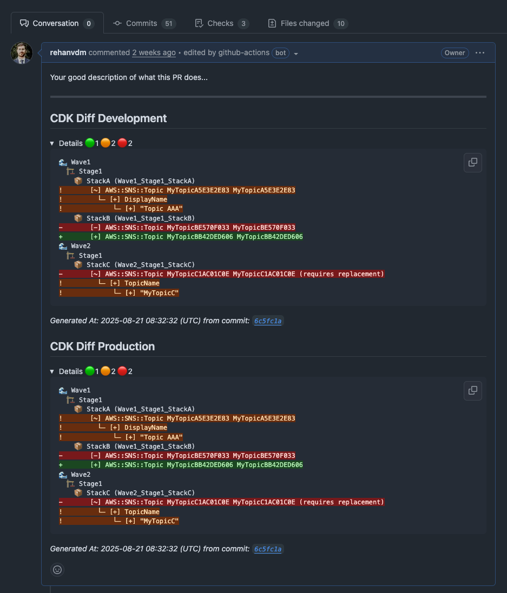
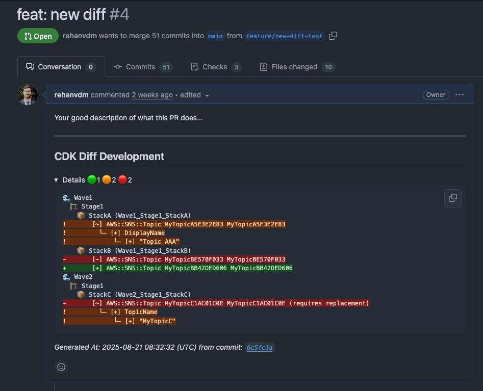
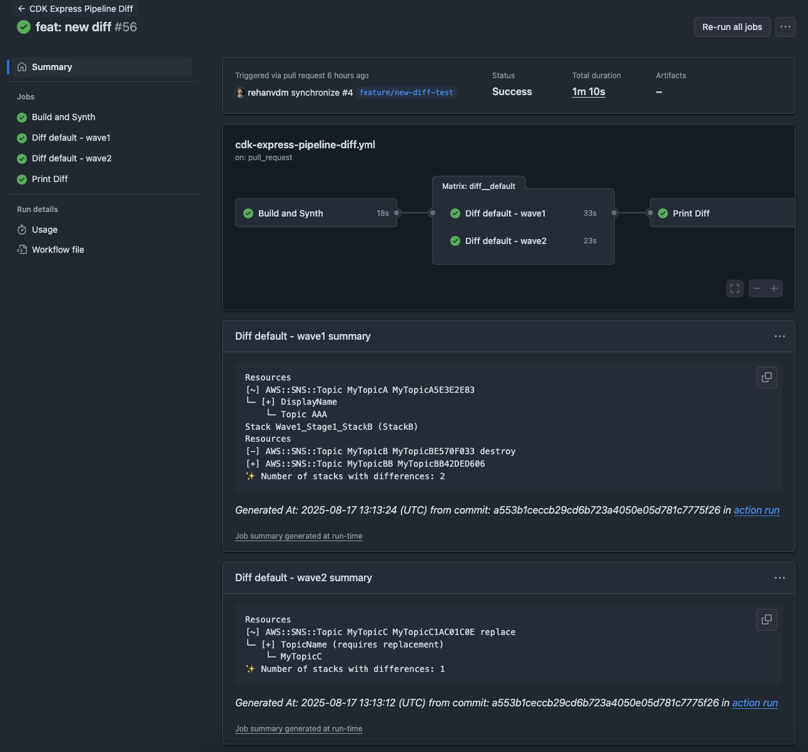

# CDK Express Pipeline GitHub Diff

A GitHub Action that generates and displays [CDK Express Pipeline](https://github.com/rehanvdm/cdk-express-pipeline)
diffs directly in your pull request description, providing clear visibility into infrastructure changes grouped by
waves, stages and stacks.

## Features

- 🔍 **Automated Diff Generation**: Automatically generates CDK diffs for Express Pipeline stacks on pull requests
- 🌊 **Wave-based Organization**: Displays diffs organized by pipeline waves and stages for better readability
- 📦 **Stack-level Details**: Shows detailed resource changes (additions, updates, deletions) for each stack
- 🔄 **Parallel Diffs**: CDK Diff your app faster by breaking them into multiple jobs (matrix supported)
- 🎯 **Selective Diffing**: Stack selectors to diff specific waves/stages/stacks enabling the use of parallel diff jobs
- 📝 **Visual Diff on PR Description**: Updates pull request descriptions with formatted diff output
- 🔍 **Full output on Action Summary**: Updates action/job run summary with the full diff output for easy access

## Usage

This action operates in two distinct modes: `generate` and `print`. Understanding these modes is essential for setting
up your workflow correctly.

### Generate Mode (`mode: 'generate'`)

The generate mode analyzes your CDK Express Pipeline assembly and creates detailed diffs for each stack. This mode:

- Must be run after `cdk synth` to generate the cloud assembly
- Analyzes your CDK Express Pipeline assembly structure
- Creates detailed diffs showing resource changes (additions, updates, deletions) for each stack
- Caches the diff data for retrieval by the print mode
- Updates action/job summaries with the full diff output

**Parameters for Generate Mode:**

- `mode`: Set to `'generate'` (required)
- `github-token`: GitHub token for API access and caching that needs `pull-requests: write` permission (required)
- `cloud-assembly-directory`: Directory containing the CDK Cloud Assembly (optional, default: `cdk.out`)
- `stack-selectors`: Comma-separated stack selectors or patterns to diff (optional, default: `**` for all stacks)
- `job-name`: Name of the job, used to link to action/job logs in summaries (optional)

### Print Mode (`mode: 'print'`)

The print mode retrieves cached diff data and updates the pull request description. This mode:

- Retrieves all cached diff data from previous `generate` jobs
- Combines diffs according to the pipeline wave/stage structure
- Updates the pull request description with formatted diff output
- Can combine results from multiple cloud assemblies

**Parameters for Print Mode:**

- `mode`: Set to `'print'` (required)
- `github-token`: GitHub token for API access and caching that needs `pull-requests: write` permission (required)
- `cloud-assembly-directory`: Directory containing the CDK Cloud Assembly (optional, default: `cdk.out`)
- `job-name`: Name of the job, used to link to action/job logs in summaries (optional)
- `cloud-assemblies`: List of cloud assemblies to print diffs from (optional). Do not specify `cloud-assembly-directory`
  when using this property as it is the "array" version of `cloud-assembly-directory` and allows you to specify multiple
  assemblies and custom headers.

### Basic - Single Job Diff

For simple workflows where you generate and display diffs in a single job.

```yaml
name: CDK Diff
on:
  pull_request:
    branches: [main]
jobs:
  cdk-diff:
    runs-on: ubuntu-latest
    permissions:
      pull-requests: write
      id-token: write
    steps:
      - uses: actions/checkout@v4
      - name: Setup Node.js
        uses: actions/setup-node@v4
        with:
          node-version: '20'
      - name: Install dependencies
        run: npm ci
      - name: Configure AWS credentials
        uses: aws-actions/configure-aws-credentials@v4
        with:
          role-to-assume: arn:aws:iam::123456789012:role/your-github-deploy-role
          aws-region: us-east-1

      - name: Synthesize CDK
        run: npm run cdk -- synth '**'

      - name: Generate CDK Diff
        uses: rehanvdm/cdk-express-pipeline-github-diff@v1
        with:
          mode: 'generate'
          github-token: ${{ secrets.GITHUB_TOKEN }}

      - name: Update PR with Diff
        uses: rehanvdm/cdk-express-pipeline-github-diff@v1
        with:
          mode: 'print'
          github-token: ${{ secrets.GITHUB_TOKEN }}
```

### Complex - Parallel Diffs using Matrix

Doing diffs in parallel can significantly speed up the process, especially for large CDK applications with many stacks.
This example shows how you can generate diffs across multiple jobs in parallel and combine the output.

<details>
<summary> Click for Workflow YAML </summary>

```yaml
name: CDK Diff Parallel
on:
  pull_request:
    branches: [main]
jobs:
  generate-diffs:
    runs-on: ubuntu-latest
    permissions:
      pull-requests: write
      id-token: write
    strategy:
      matrix:
        include:
          - job-name: Diff default - wave1
            selectors: 'Wave1_*'
          - job-name: Diff default - wave2
            selectors: 'Wave2_*'
    steps:
      - uses: actions/checkout@v4
      - name: Setup Node.js
        uses: actions/setup-node@v4
        with:
          node-version: '20'
      - name: Install dependencies
        run: npm ci
      - name: Configure AWS credentials
        uses: aws-actions/configure-aws-credentials@v4
        with:
          role-to-assume: arn:aws:iam::123456789012:role/your-github-deploy-role
          aws-region: us-east-1

      - name: Synthesize CDK
        run: npm run cdk -- synth '**'
      - name: Generate CDK Diff
        uses: rehanvdm/cdk-express-pipeline-github-diff@v1
        with:
          mode: 'generate'
          stack-selectors: ${{ matrix.selectors }}
          github-token: ${{ secrets.GITHUB_TOKEN }}
          job-name: ${{ matrix.job-name }}

  print-diffs:
    needs: generate-diffs
    runs-on: ubuntu-latest
    permissions:
      pull-requests: write
      id-token: write
    steps:
      - name: Update PR with Combined Diffs
        uses: rehanvdm/cdk-express-pipeline-github-diff@v1
        with:
          mode: 'print'
          github-token: ${{ secrets.GITHUB_TOKEN }}
```

</details>

### Advanced - Multiple Cloud Assemblies

You might want to do multiple diffs per environment on a single PR. For example, doing both `dev` and `prod` diffs on
the PR to `main` enables catching issues on `prod` early, before the code is merged to `main`. This can be done by
generating Cloud Assemblies with `cdk synth --output ASSEMBLY_DIR` for each environment and then using their output
directories in the action.

This example does a `**` diff to keep it brief, but you can also do the diffs in parallel using the matrix strategy as
shown above.

<details>
<summary> Click for Workflow YAML </summary>

```yaml
name: Diff Multiple Assemblies
on:
  pull_request:
    branches: [main]
jobs:
  diff-envs:
    name: CDK Diff Environments
    runs-on: ubuntu-latest
    permissions:
      pull-requests: write
      id-token: write
    strategy:
      matrix:
        include:
          - cloud-assembly-directory: cdk.out/dev
          - cloud-assembly-directory: cdk.out/prod
    steps:
      - name: Checkout repo
        uses: actions/checkout@v4
      - name: Set up node
        uses: actions/setup-node@v3
        with:
          node-version: 20
          cache: npm
      - name: Install dependencies
        run: npm ci
      - name: Configure AWS credentials
        uses: aws-actions/configure-aws-credentials@v4
        with:
          role-to-assume: arn:aws:iam::123456789012:role/your-github-deploy-role
          aws-region: us-east-1

      - name: CDK Synth
        run: npm run cdk -- synth '**' --output ${{ matrix.cloud-assembly-directory }}
      - name: Generate CDK Diff
        uses: rehanvdm/cdk-express-pipeline-github-diff@feature/init
        with:
          mode: generate
          github-token: ${{ secrets.GITHUB_TOKEN }}
          cloud-assembly-directory: ${{ matrix.cloud-assembly-directory }}

  print-diffs:
    name: CDK Diff and Deploy
    runs-on: ubuntu-latest
    needs:
      - diff-envs
    permissions:
      pull-requests: write
      id-token: write
    steps:
      - name: Checkout repo
        uses: actions/checkout@v4
      - name: Update PR with Diff
        uses: rehanvdm/cdk-express-pipeline-github-diff@feature/init
        with:
          mode: print
          github-token: ${{ secrets.GITHUB_TOKEN }}
          cloud-assemblies: |
            - header: CDK Diff Development
              directory: cdk.out/dev
            - header: CDK Diff Production
              directory: cdk.out/prod
```

Will produce the following:



</details>

## Example Outputs

### PR Description output

The action will append a formatted diff to the pull request description, it will never overwrite the existing
description. Here's an example of what it looks like:



### Action Summary output

The action will also update the action/job summary with the full CDK diff output without any changes:



## How It Works

1. **Generate Mode**:
   - You must run `cdk synth` before using this action to generate the cloud assembly
   - Analyzes your CDK Express Pipeline assembly
   - Creates detailed diffs for each stack showing resource changes and creates the action/job summaries
   - Caches the diff data for retrieval by the print mode job
2. **Print Mode**:
   - Retrieves all cached diff data from previous generate jobs
   - Combines diffs according to the pipeline wave/stage structure
   - Updates the pull request description with formatted diff output

## Stack Selectors

The `stack-selectors` input supports various patterns:

- `**` - All stacks (default)
- `Wave1_*` - All stacks in all stages for `Wave1`
- `Wave1_Stage1_*,Wave1_Stage2_*` - All stacks in `Stage1` and `Stage2` for `Wave1`

See more details in the
[CDK Express Pipeline documentation](https://rehanvdm.github.io/cdk-express-pipeline/guides/selective-deployment/)

## FAQ

### What happens if I have a big diff and it exceeds the GitHub comment size limit?

The diff will be truncated, 260kb is a lot of space and most will not have this issue. However, if you do hit the limit,
the action will still update the pull request description up to the limit and indicate it was truncated. The full diff
will still be available in the action summary and you can always find it in the action logs.

### Why not place the diff in a comment(s)?

Placing comments creates a lot of noise and can clutter the pull request discussion, especially when doing many parallel
diffs where each diff is a comment. Instead, this action updates the pull request description and action summary with
the diff, providing a cleaner and more organized view of changes. Accepting the 260KB description limit is a trade-off
for a cleaner PR experience.

### Can I use this action with non-Express Pipeline CDK applications?

This action is specifically designed for CDK Express Pipeline applications. It relies on the wave/stage/stack structure
that Express Pipeline provides. For regular CDK applications, you may want to use alternative diff actions.

### How do I handle authentication for the action?

The action requires a GitHub token with `pull-requests: write` permission to update PR descriptions and action
summaries.

## Credits

This action is inspired by [cdk-diff-action](https://github.com/corymhall/cdk-diff-action)

## Contributing

1. Fork the repository
2. Create a feature branch
3. Make your changes
4. Add tests if applicable
5. Submit a pull request

## License

This project is licensed under the MIT License - see the [LICENSE](LICENSE) file for details.

## Support

If you encounter any issues or have questions:

- Open an issue on GitHub
- Check existing issues for solutions
- Review the action logs for detailed error information
